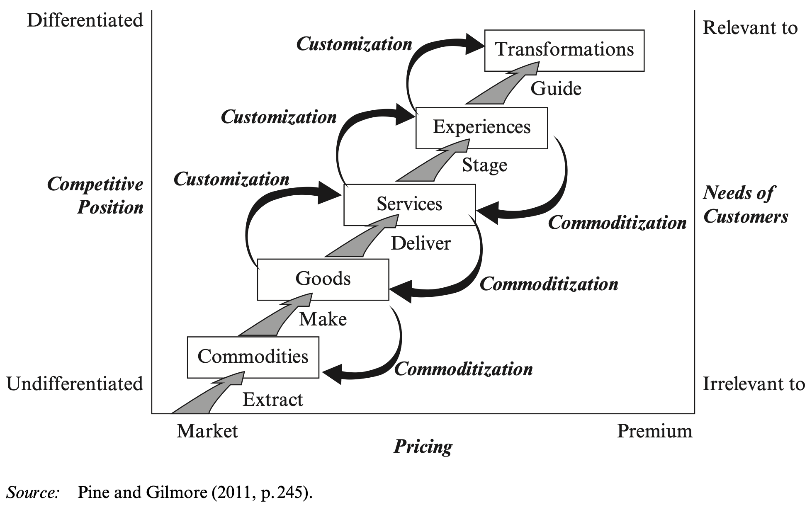

## Samenvatting van de paper: "The Experience Economy: Past, Present and Future"

### Inleiding

In de afgelopen twintig jaar is de term "experience economy" een centraal concept geworden in het economische discours. Waar vroeger de focus lag op goederen en diensten, is de nadruk nu verschoven naar ervaringen als een belangrijke bron van economische waarde. Dit concept ontstond uit de observatie dat consumenten steeds meer waarde hechten aan ervaringen boven fysieke goederen of standaard diensten.

### Oorsprong

De oorsprong van de experience economy gaat terug naar het begin van de jaren '90. Joseph Pine, die een les gaf over mass customization, merkte op dat het massaal aanpassen van diensten deze automatisch transformeert tot ervaringen. Deze observatie leidde tot de erkenning dat ervaringen een onderscheidende economische waarde hebben en zelfs een nieuwe economische offering kunnen vormen, naast goederen en diensten.

### Evolutie van Economieën

Pine en Gilmore beschrijven vijf verschillende economieën, elk met hun eigen primaire economische offering en kenmerken:

1. **Agrarische Economie**:
   - **Overgang**: Startpunt met de nadruk op extractie van natuurlijke grondstoffen.
   - **Primaire Offering**: Commodities (grondstoffen).
   - **Functie**: Extractie.
   - **Kenmerken**: Fungibel, ongedifferentieerd, ruilen op basis van prijs, natuurlijke producten die worden verbouwd of geoogst.

2. **Industriële Economie**:
   - **Overgang**: Verschuiving naar massaproductie door de Industriële Revolutie.
   - **Primaire Offering**: Goederen.
   - **Functie**: Productie.
   - **Kenmerken**: Tangibel, gestandaardiseerde producten die in batches worden vervaardigd, differentiatie op basis van eigenschappen.

3. **Diensteneconomie**:
   - **Overgang**: Verschijning van diensten als primaire economische offering door urbanisatie.
   - **Primaire Offering**: Diensten.
   - **Functie**: Levering.
   - **Kenmerken**: Ontastbaar, op maat gemaakte diensten die op aanvraag worden geleverd.

4. **Experience Economy**:
   - **Overgang**: Diensten worden verrijkt met gedenkwaardige ervaringen.
   - **Primaire Offering**: Ervaringen.
   - **Functie**: Creatie.
   - **Kenmerken**: Memorable, op maat gemaakte ervaringen, ervaren over een bepaalde tijdsduur, tijdens de levering.

5. **Transformation Economy**:
   - **Overgang**: Focus op het bieden van transformaties die persoonlijke groei en verandering stimuleren.
   - **Primaire Offering**: Transformaties.
   - **Functie**: Begeleiding.
   - **Kenmerken**: Duurzame, diepgaande veranderingen, gericht op de persoonlijke ontwikkeling van de klant.

*De evolutie van economische waarde.*

### Overgangen Tussen de Economieën

- **Van Agrarische naar Industriële Economie**:
  - De transformatie van een economie gericht op extractie naar een economie gericht op productie gebeurde dankzij technologische vooruitgang en industrialisatie. Dit leidde tot de opkomst van fabrieken en massaproductie van goederen die goedkoper en efficiënter waren dan ambachtelijke productie.

- **Van Industriële naar Diensteneconomie**:
  - Naarmate de productiecapaciteit toenam en de kosten van goederen daalden, verschoven consumentenvoorkeuren naar diensten die meer waarde boden dan alleen fysieke producten. Dit werd mogelijk gemaakt door urbanisatie en veranderingen in levensstijl die een grotere vraag naar diverse diensten creëerden.

- **Van Diensteneconomie naar Experience Economy**:
  - Diensten evolueerden verder door de toevoeging van ervaringen die emotioneel en memorabel waren. Bedrijven begonnen zich te richten op het creëren van gedenkwaardige klantinteracties en het vervullen van diepere behoeften van consumenten door unieke ervaringen te bieden.

- **Van Experience Economy naar Transformation Economy**:
  - De volgende stap in economische evolutie legt de nadruk op persoonlijke transformaties. In plaats van alleen ervaringen aan te bieden, richten bedrijven zich nu op het begeleiden van klanten naar duurzame veranderingen en zelfverbetering, waardoor diepgaande en langdurige impact op het leven van klanten wordt gerealiseerd. 

### Huidige Stand van Zaken

De experience economy heeft zich ontwikkeld tot een fundamentele verschuiving in de wereldwijde economie. Bedrijven proberen zich te onderscheiden door unieke en gedenkwaardige ervaringen (*User Experiences*) aan te bieden, terwijl consumenten op zoek zijn naar betekenisvolle en waardevolle manieren om hun tijd en geld te besteden. Dit heeft geleid tot een groei in werkgelegenheid en economische expansie gebaseerd op ervaringen. Innovatieve methoden zoals design thinking, ethnografisch onderzoek en creatieve improvisatie skills worden steeds vaker gebruikt om unieke ervaringen te creëren.

### Toekomst

Vooruitkijkend suggereren Pine en Gilmore dat de volgende stap in deze economische evolutie de "transformation economy" is. Hierbij gaat het niet alleen om het aanbieden van ervaringen, maar om transformaties die persoonlijke groei en verandering bij de consument teweegbrengen. Deze transformaties zijn diepgaander en persoonlijker, en vereisen een bereidheid van zowel bedrijven als consumenten om deze nieuwe vormen van economische waarde te omarmen.

### Conclusie

De experience economy vertegenwoordigt een aanzienlijke verandering in de manier waarop economische waarde wordt gecreëerd en ervaren. Door de nadruk te leggen op persoonlijke en betekenisvolle ervaringen, biedt deze benadering nieuwe mogelijkheden voor economische innovatie en groei. Bedrijven moeten deze verschuiving begrijpen en zich aanpassen om te blijven concurreren in deze nieuwe economische realiteit.

Deze uitgebreide samenvatting biedt een overzicht van de belangrijkste punten uit de paper ["The Experience Economy: Past, Present and Future" door B. Joseph Pine II en James H. Gilmore](Handbook-ExperienceEconomyPastPresentandFuture.pdf). Het beschrijft de ontwikkeling, huidige staat en toekomstige richting van de experience economy, evenals de verschillen tussen de vijf economische fases.